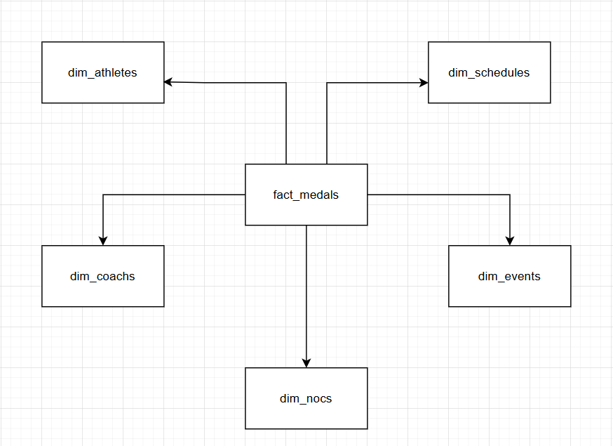

# Paris Olympics 2024: End-to-End Data Pipeline on Azure

This project demonstrates a comprehensive Data Engineering pipeline leveraging the **Azure Ecosystem** to process and analyze the Paris Olympics 2024 dataset. The architecture follows the **Medallion Architecture** (Bronze-Silver-Gold) to transform raw data into analytics-ready insights.

## Architecture
- **Data Ingestion:** Azure Data Factory (ADF) fetching data from PostgreSQL (CDC) and HTTP API sources.
- **Data Lake:** Azure Data Lake Storage (ADLS) Gen2 used as the primary storage.
- **Data Transformation:** Azure Databricks (PySpark) for cleansing, standardizing, and modeling.
- **Storage Format:** Delta Lake for ACID transactions and scalability.
- **Data Modeling:** Star Schema design in the Gold layer for optimized analytical queries.

## Key Features
- Automated Orchestration: Fully automated ETL workflow using Azure Data Factory.
- Medallion Architecture: - Bronze: Raw data ingestion in its native format.
    - Silver: Cleaned and standardized data (Handling missing values, schema enforcement). 
    - Gold: Aggregated data and Star Schema (Fact and Dimension tables) for business intelligence.
- Scalable Processing: Utilized PySpark on Databricks clusters for efficient large-scale data transformation.

## Tech Stack
- Languages: Python (PySpark), SQL
- Cloud Provider: Microsoft Azure
- Data Integration: Azure Data Factory
- Compute: Azure Databricks
- Storage: ADLS Gen2, Delta Lake

## Business Insights
The final Gold layer enables analysis such as:
- Total medal counts by country and sport.
- Athlete performance trends across different venues.
- Schedule optimization based on historical results.

## DAG

## Silver (Star Schema)
